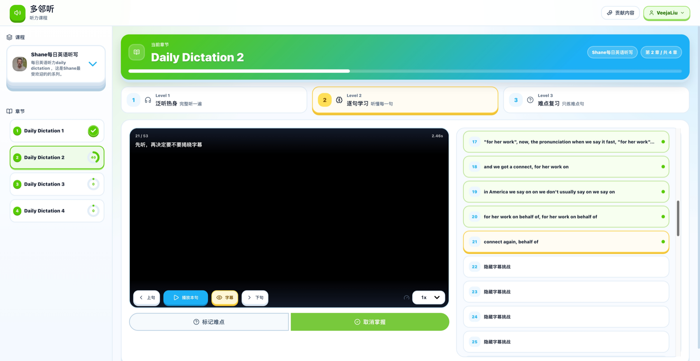
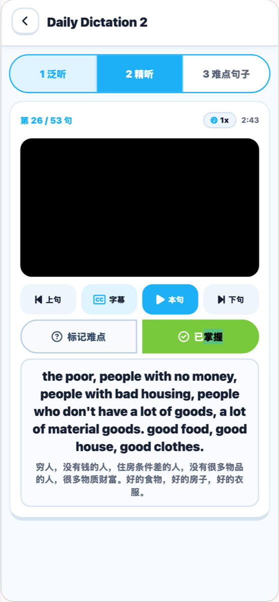
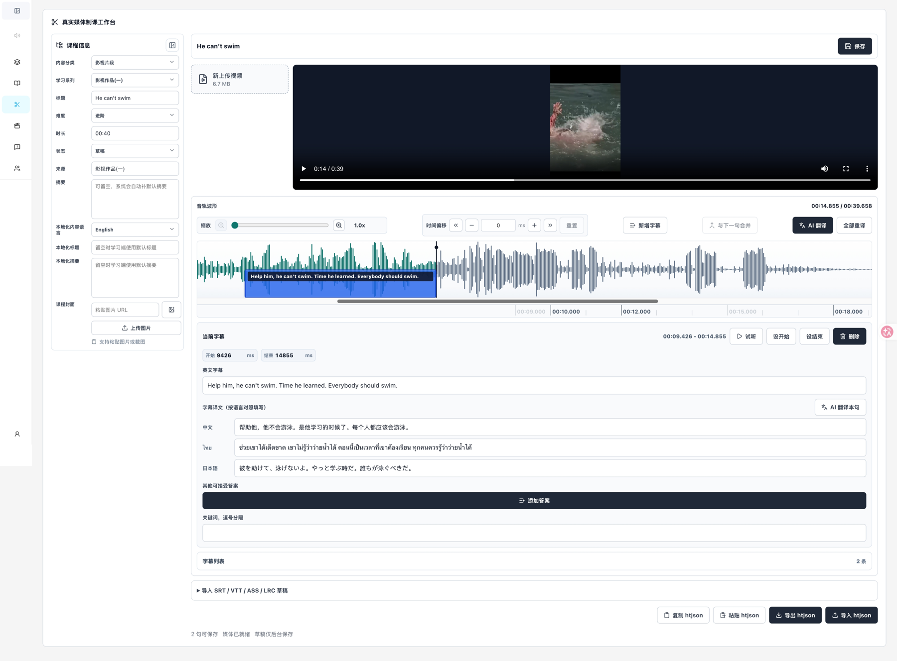

<p align="center">
  
</p>

# 多邻听 DuolinTing

> 把真实世界的音频和视频，变成可以逐句听懂、反复练习、持续积累的精听课程。

多邻听是一套开源的语言听力学习产品，也是一套完整的听力内容制作工具。它不只是一个播放器：学习者可以沿着「泛听 → 精听 → 难点复习」的路径学习真实材料；内容创作者则可以上传媒体、切分字幕、校准时间轴、生成多语言翻译，再把课程发布给学习者。

项目目前包含 Web 学习端、移动端、内容管理后台和统一后端，适合个人学习、教师制课、语言培训和自建听力资料库。

## 灵感与致敬

多邻听的诞生受到了 [YouZack](https://www.youzack.com/) 的启发。在征询并获得 YouZack 作者杨中科老师的许可后，我们基于自己的学习需求开始了这个独立实现，以此向 YouZack 在英语学习与精听实践上的探索致敬。[查看相关邮件往来](docs/images/youzack-authorization-email.png)。

我们希望延续那种重视真实语料、反复聆听和主动理解的学习精神，再用开源方式打造一套可自由部署、制作内容并持续扩展的听力学习工具。项目不会抓取或复制 YouZack 整理的配套字幕；课程、字幕及其他内容应由使用者自行制作或通过合法来源取得。

DuolinTing 是一个独立的开源项目，并非 YouZack 官方产品；上述许可不代表 YouZack 对本项目提供官方背书。

## 为什么做多邻听？

真实听力材料往往有两个问题：直接播放太难，逐句整理又太费时间。多邻听希望把这段距离缩短：

- 不脱离真实语速和真实语境，而是把长媒体拆成可练习的句子。
- 不把字幕当成答案直接展示，而是让学习者先听、再判断、再核对。
- 不让「听不懂」一闪而过，难句可以标记、复习和持续追踪。
- 不只服务学习者，也给内容创作者一套从媒体到课程的生产流程。

## 一套完整的三阶段听力练习

### 1. 泛听热身

先完整听一遍，建立对主题、说话人和语境的整体认识。这个阶段不追求听清每一个词。

### 2. 逐句精听

按时间轴播放单句，在显示字幕前先尝试听懂。学习者可以控制播放速度、重复播放、查看翻译、记录听写，并将句子标记为「难点」或「已掌握」。

### 3. 难点复习

系统集中呈现仍然不熟悉的句子，让练习从「再听一遍整课」变成「只练真正需要练的部分」。

## 产品预览

### Web 学习端

课程、章节和学习阶段被组织在同一个学习空间中，句子进度、难点和掌握状态会持续保存。



### 移动端

移动端保留相同的三阶段学习方法，并针对单手操作重新组织播放、字幕和掌握状态。

<p align="center">
  
</p>

### 真实媒体制课工作台

管理后台支持上传音频或视频、查看波形、拖动句子区间、校准毫秒级时间、编辑原文与多语言译文，并导入 SRT、VTT、ASS、LRC 等字幕格式。



## 主要能力

学习者可以：

- 按内容分类、学习系列和课程探索听力材料。
- 在泛听、逐句精听和难点复习之间切换。
- 精确播放单句，调整速度，显示或隐藏字幕与翻译。
- 标记难点、确认掌握、记录听写、笔记和生词。
- 登录后在 Web 与移动端保存学习进度。
- 查看连续学习、活动概览和排行榜。

内容创作者和管理员可以：

- 管理内容分类、学习系列、课程信息与发布状态。
- 上传真实音频、视频和课程封面。
- 通过媒体波形创建和调整逐句时间轴。
- 导入常见字幕文件，并自动识别双语内容。
- 为中文、英语、泰语和日语维护本地化课程信息与字幕翻译。
- 审核学习者提交的可接受答案反馈和学习活动。

## 项目组成

这是一个 npm workspaces monorepo：

| 项目 | 用途 | 主要技术 |
| --- | --- | --- |
| `web-app` | 浏览器学习端 | React 19、Vite、Radix UI |
| `mobile-app` | iOS、Android 与移动 Web 学习端 | Expo 54、React Native |
| `admin` | 内容管理与真实媒体制课 | React 19、Ant Design、WaveSurfer |
| `backend` | 目录、课程、账号、进度、反馈和媒体 API | Node.js、Express 5、Sequelize |
| `packages/*` | 领域类型、API 客户端、运行配置和设计令牌 | TypeScript |

本地基础设施使用 MySQL、MinIO 和 Flyway。生产部署可以把三个前端作为独立应用运行，并通过同源 `/api/` 访问统一后端。

## 快速开始

需要先安装 Node.js、npm 和 Docker。

```bash
npm install
cp .env.example .env
npm run infra:up
npm run db:migrate
npm run dev
```

启动后可以访问：

- 学习端：<http://127.0.0.1:8101>
- 管理后台：<http://127.0.0.1:8102>
- 后端健康检查：<http://127.0.0.1:8100/api/health>
- MinIO 控制台：<http://127.0.0.1:9001>

只启动某个应用：

```bash
npm run dev:backend
npm run dev:web-app
npm run dev:admin
npm run dev:mobile-app
```

## 内容是如何进入学习端的？

```text
上传音频或视频
      ↓
导入或编辑字幕
      ↓
在波形上校准每句开始/结束时间
      ↓
补充翻译、答案、关键词和课程信息
      ↓
发布课程
      ↓
学习者按泛听 → 精听 → 难点复习完成学习
```

仓库不会在迁移或应用代码中内置课程。学习端只展示通过管理后台创建并发布的内容。

## 数据与隐私

学习进度包含句子掌握状态、重复次数、听写、笔记和生词，并按登录用户隔离保存。管理员接口需要单独的管理员会话；媒体上传、课程编辑和学习者活动报表不会向普通学习者开放。

请只在本地 `.env` 中保存数据库密码、对象存储密钥、JWT 密钥和第三方 API Key，不要把真实凭据提交到 Git。

## 常用质量检查

```bash
npm run typecheck
npm run build
npm run lint
```

## 参与项目

欢迎提交问题、改进建议和代码贡献。特别欢迎以下方向：

- 更好的逐句听力交互和无障碍体验。
- 更多字幕格式、时间轴编辑和制课自动化能力。
- 新语言的界面与课程本地化。
- 移动端体验、离线学习和跨端同步。
- 自动化测试、安全性和部署体验。

提交代码前请先阅读 [AGENTS.md](AGENTS.md)，其中记录了项目结构、数据库约束、前端约定和质量要求。

## 社区

感谢 [LINUX DO](https://linux.do) 为开源开发者提供交流与共建的平台。

## 贡献者名单 Contributors

感谢每一位参与 DuolinTing 的贡献者：

[](https://github.com/VeejaLiu/duolinting/graphs/contributors)

## Star History

[](https://star-history.dera.page/#VeejaLiu/duolinting&Date)

## License

DuolinTing 使用 [Apache License 2.0](LICENSE) 开源。
